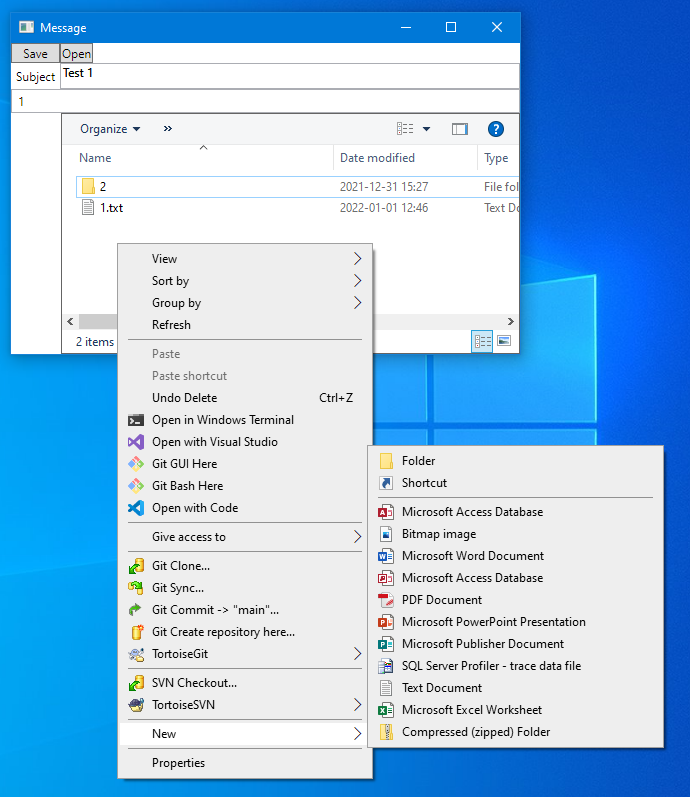

# EmlEditor

This is an editor for `*.eml` files. An `*.eml` file consists of some mail header fields and one or more files organized in a folder structure like an archive file. The *EmlEditor* shows this structure in an Explorer-like window and lets you edit the individual files thru the applications you've installed on your local system, e.g. *Notepad* for simple `*.txt` files.

## Workflow

### Open
 Start editing your `*.eml` file by
 
 ```
 EmlEditor myfile.eml
 ```

 or simply start

 ```
 EmlEditor
 ```

 and use the *Open* command to open an existing `*.eml` file or to create a new one. As a result you can see the content files of your `*.eml` file.

 ### Edit contained files
 Doubleclick on a content file or use its context menu in order to open it in an associated application. Modify the file using that application.

 ### Add a content file or folder
 Use the *New* command of the context menu in order to add a new content file or a new content folder.
.

The first character of the content file's name designates the nature of the content file:

| First character | Nature | Example | Generated header field
| --------- | ---- | --- |
| `0` to `9` | Main content | `1.txt` for plain text and `2.html` for rich text. | *(none)* |
| `#` | Auxiliary content | `#sun.png` | `Content-ID: <sun>` |
| `'` | Attachment | `'1stFile.txt` | `ContentDisposition:	attachment; filename=1stFile.txt` |
| other | Attachment | `Pricelist.docx` | `ContentDisposition:	attachment; filename=Pricelist.docx` |

